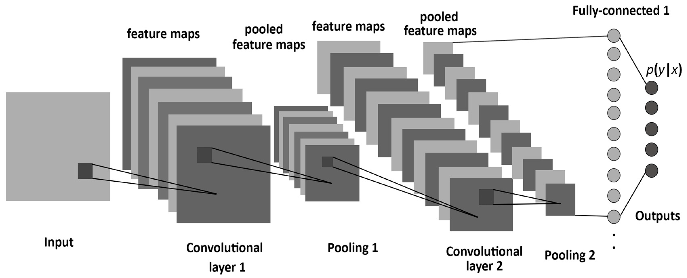
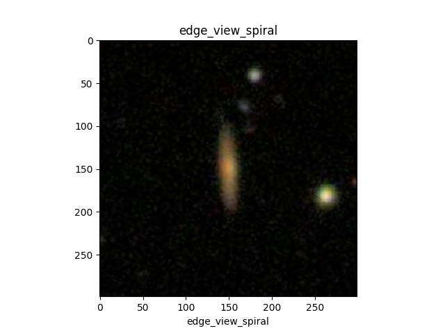

# Galaxy Classification Using Convolutional Neural Networks

### Background
Galaxies are one of the most visually stunning cosmic phenomenon and with Sloan Digital Sky Survey and Hubble, we now have thousands of photometry of galaxies to admire. The problem for astronomers, however, is classifying these galaxy images. The goal of this project was to design a Convolutional Neural Network (CNN) for image classification, which is a tool already in use in recent research in the field.
Convolutional Neural Networks (CNN) are a great approach to this problem as they are very effective specifically in image recognition. Like other neural nets, CNNs are made up of layers of neurons (which process input) and their respective weights but CNNs operate over volumes. The system slides a filter across an image and the resulting layer is the convolutional layer, which then pools into filter maps. This repeats for any number of convolutional layers in a network. This breaks the image down into parts for the machine to learn. Below is an image representation of a CNN.

[A Framework for Designing the Architectures of Deep Convolutional Neural Networks](https://www.mdpi.com/1099-4300/19/6/242)

### Data

The data originally comes from galaxy zoo - a project where volunteers labeled thousands of galaxies through a series of eleven questions. The data was then converted to jpg files for Kaggle.
I set up a label category from the training solution file, which had the percentage of users who chose a particular response to the identifying questions for each image.
The list of questions users answered:

- Q1. Is the object a smooth galaxy, a galaxy with features/disk or a star/unsure? (3 responses)
- Q2. Is it edge-on? (2 responses)
- Q3. Is there a bar? (2 responses)
- Q4. Is there a spiral pattern? 2 responses
- Q5. How prominent is the central bulge? (4 responses)
- Q6. Is there anything "odd" about the galaxy? (2 responses)
- Q7. How round is the smooth galaxy? (3 responses)
- Q8. What is the odd feature? (7 responses)
- Q9. What shape is the bulge in the edge-on galaxy? (3 responses)
- Q10. How tightly wound are the spiral arms? (3 responses)
- Q11. How many spiral arms are there? (6 responses)

These questions corresponded to this decision tree:

[Decision Tree, Willett et al](https://www.kaggle.com/c/galaxy-zoo-the-galaxy-challenge#the-galaxy-zoo-decision-tree)

Using this decision tree, I chose the questions that most identified the main types of galaxies and categorized them by percentages over 70%. I decided to include a category for edge-view spirals because, while they are not cosmologically different from spirals they do appear different for both the computer and the viewer. This gave me five initial labels: spiral, barred spiral, edge-view spiral, elliptical, and other (star or unsure if they did not have over 70% agreement). I then removed the unsure category because I only wanted labels within a particular certainty for training. Using this system, I ended up with 15,170 total images to train the system on.

### Methodology
I used AWS cloud computing for training the neural network. The images below show the model loss and model accuracy over number of epochs.

Final CNN architecture:
- Number of classes: 4
- Target image size: 299x299
- Batch size: 8
- Epochs: 40
- Convolutional layers: 4, with relu activation
- Dense layers: 4
- Dropout: 0.5
- Output layer:  softmax activation
- Optimization: stochastic gradient descent
- Processing: xception preprocess_input
- Learning rate: 0.001

### Results

Overall, the CNN performed very well with a loss of 0.252 and a mean accuracy of 90.9%. The network performed best with ellipticals and edge-view spirals and worst with barred spirals. This was in the expected bounds however, with barred spirals being difficult to discern from regular spirals at this resolution even for humans.

|                  | precision | recall | f1-score | support |
|:----------------:|:---------:|--------|----------|---------|
|   barred-spiral  |    0.7    | 0.71   | 0.7      | 95      |
| edge-view spiral |    0.94   | 0.97   | 0.95     | 186     |
|    elliptical    |    0.97   | 0.93   | 0.95     | 815     |
| spiral           | 0.84      | 0.89   | 0.86     | 421     |
| avg/total        | 0.91      | 0.91   | 0.91     | 1517    |

Below are example images with the actual label (according to majority vote) on top and the network’s predicted label on bottom.

###### Correct:

|         barred-spiral         |        edge-view spiral        |           elliptical           |              spiral             |
|:-----------------------------:|:------------------------------:|:------------------------------:|:-------------------------------:|
|  |  |  |  |
|  |  |  |  |

###### Incorrect:

|         barred-spiral         |        edge-view spiral        |           elliptical           |              spiral             |
|:-----------------------------:|:------------------------------:|:------------------------------:|:-------------------------------:|
|  |  |  |  |

### App:

Next, I built an app that allows a participant to compete against the machine in classifying images. More than just showing the skills of the neural network, this type of deployment could be used for educational purposes and to inspire an interest in space exploration among students and the public. I built the app using Flask and html and I used docker for virtualization.

### Conclusion:
In the first run of the network, it became clear that the neural network was mostly categorizing by color since all of the correctly identified spiral galaxies wee blue. While color is still relevant to identification, as only spirals will have the blue young stars due to their gas rich arms, shape is necessary to discern between spiral and barred-spiral galaxies or in the case of redder spirals (due to a variety of potential factors such as emission absorbing gas). With the latest version, it is clear looking at some of the example images that the network is now picking up on shape as well as color. The network is able to correctly identify spirals and barred-spirals that are not blue. Additionally, the network’s accuracy score has improved from a previous 77%. For overall performance, the neural net performed within the expected range (based on related works with a similar amount of categories3).

### References:

Papers:
- Alexandre Gauthier,∗ Archa Jain, and Emil Noordeh, Galaxy Morphology Classification. Stanford University 2016
- Albelwi, S.; Mahmood, A. A Framework for Designing the Architectures of Deep Convolutional Neural Networks. Entropy 2017, 19, 242.
- Willett et al. Galaxy Zoo 2: detailed morphological classifications for 304,122 galaxies from the Sloan Digital Sky Survey 2013

Galaxy classification CNN models for reference:
- [Taryn Heilman](https://github.com/tarynheilman/DSI-Capstone-Project)
- [James Lawlor](https://github.com/jameslawlor/kaggle_galaxy_zoo)

Data:
- [Galaxy Zoo](www.galaxyzoo.org)
- [Kaggle](https://www.kaggle.com/c/galaxy-zoo-the-galaxy-challenge)
